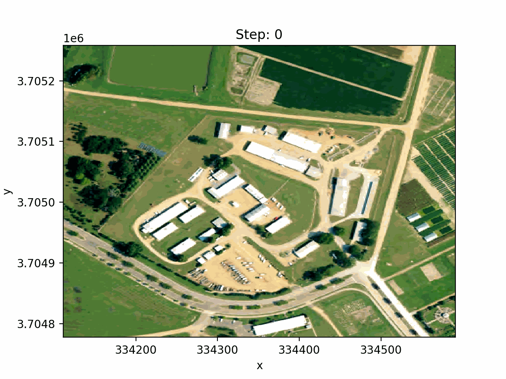

[](https://github.com/psf/black)
[](https://colab.research.google.com/github/lbferreira/geocoreg/blob/main)
# geocoreg
A library to simplify the process of co-registering geospatial data.
Althought some great libraries provide co-registration functionalities, such as scikit-image and kornia, they don't directly support geospatial data. This library aims to provide a simple and easy-to-use interface to co-register geospatial data in a pythonic way. The library design was created to allow the user to select different co-registration methods from different back-end libraries. For an easier utilization, Xarray DataArrays are supported (dask is not supported yet).

Warning: This library is still in early development and the API may change.

## Installation
To install the package, run the command below
```
pip install git+https://github.com/lbferreira/geocoreg
```

## Usage
To coregister a single image or multiple images (e.g., a time series) in relation to a reference image, you can use the `coregister` function, as shown below.
```python
import xarray
import rioxarray
from geocoreg import visualization as vz, xr_registration

# Load sample data
da = rioxarray.open_rasterio("naip_example.tif")
da = da.assign_coords(band=['red', 'green', 'blue'])
# Simulate a time series with some shifts
shifted_series = xarray.concat(
    [
        da.assign_coords(time=0),
        da.shift(x=10, y=10).assign_coords(time=1),
        da.shift(x=-5, y=8).assign_coords(time=2),
    ],
    dim="time",
)
# Export a gif with the original series
vz.export_animation(shifted_series, 'time', file_name='original_series.gif')
```


```python
# Define the reference image as the first image of the time series
dst_img = shifted_series.isel(time=0)
# Coregistrate the time series with the reference image
ts_registrated = xr_registration.coregistrate(shifted_series, dst_img, registrator='pcc', registration_band='red')
# Export a gif with the registrated series
vz.export_animation(ts_registrated, 'time', file_name='registrated_series.gif')
```


## Acknowledgements
This library was developed as part of
my research work in the [GCER lab](https://www.gcerlab.com/), under supervision of Vitor Martins, at the Mississippi State University (MSU). This research is funded by USDA NIFA (award #2023-67019-39169), supporting Lucas Ferreira and Vitor Martins at MSU.